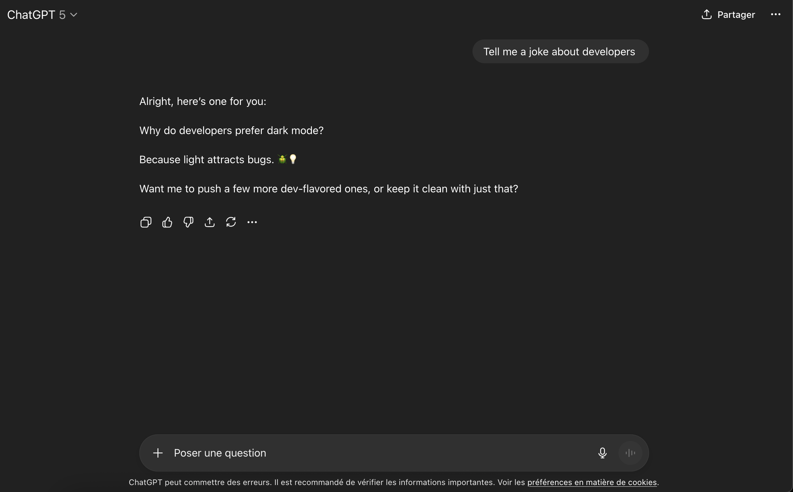
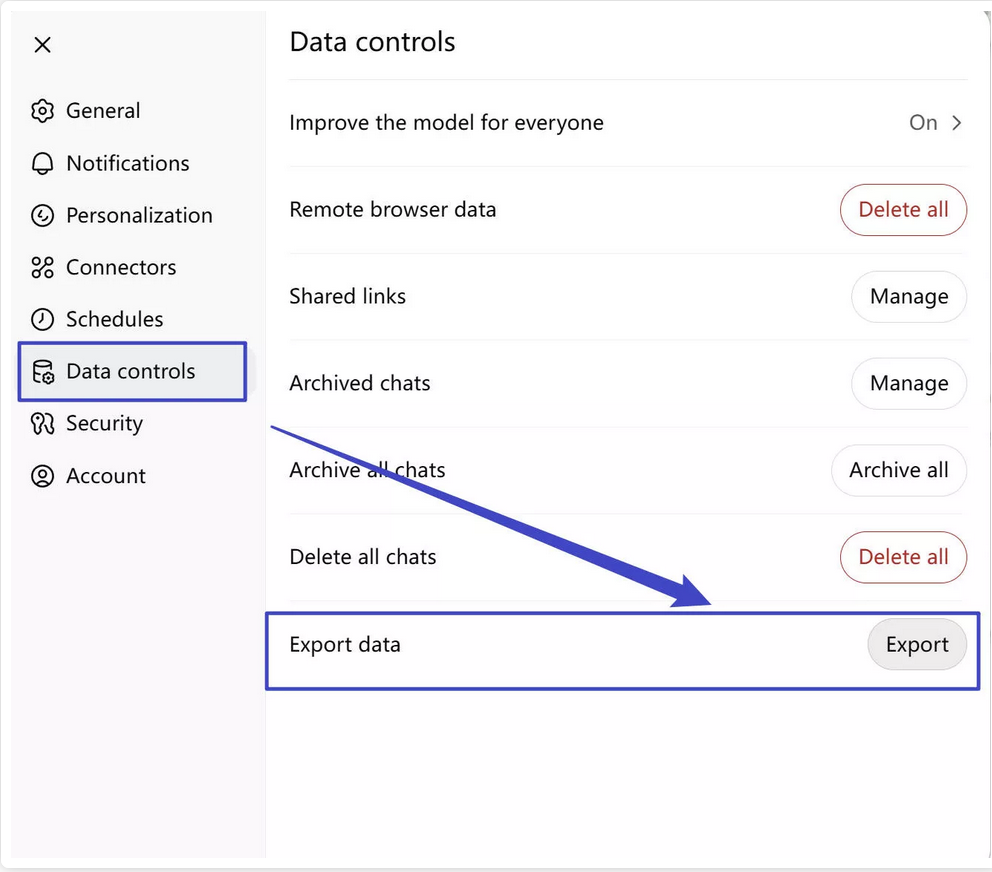
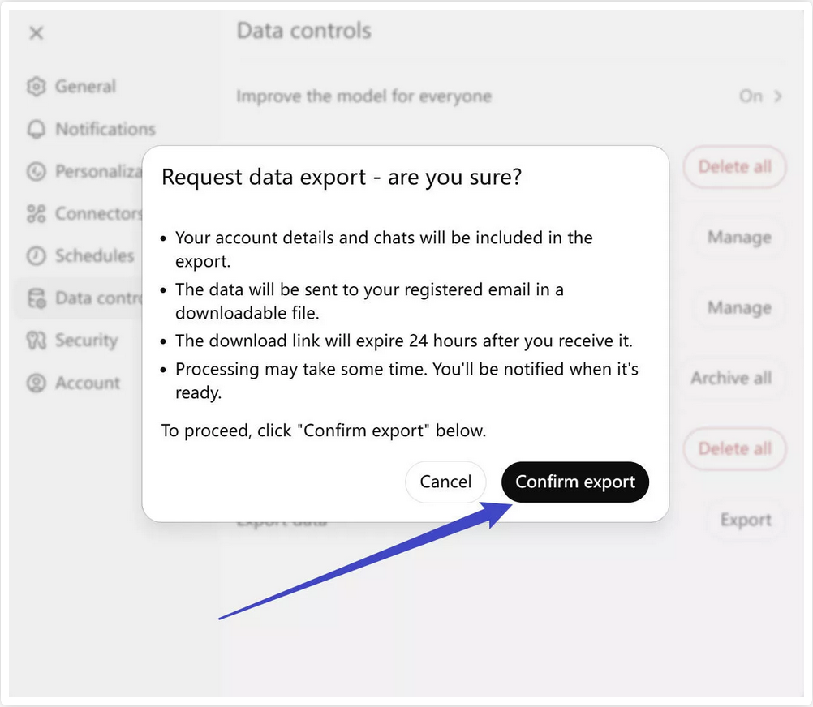
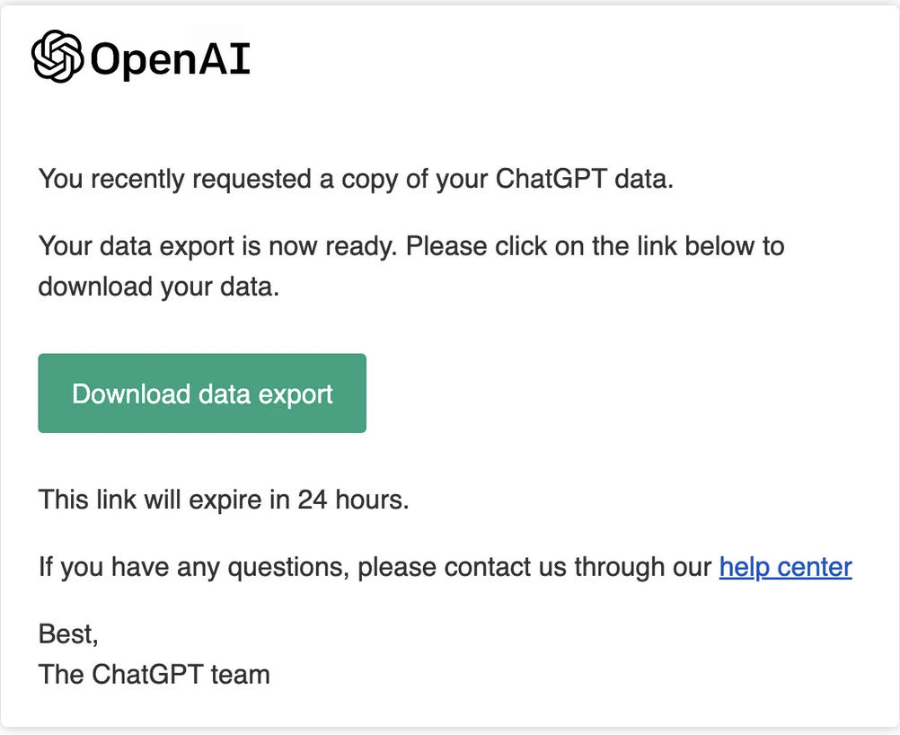
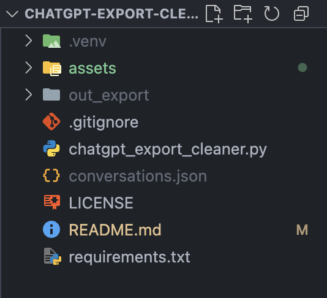
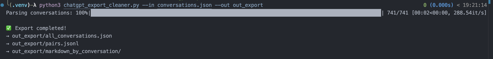
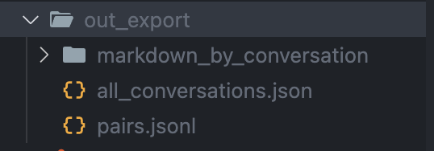
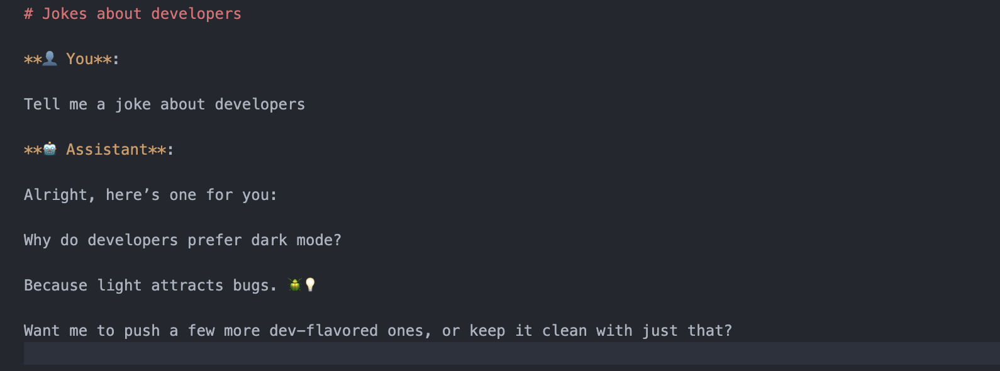

# 🧹 ChatGPT Export Cleaner

A script to parse and clean OpenAI ChatGPT data exports, and convert them into clean Markdown conversations, JSON file for structured export of all chats and prompt-completion JSONL files for fine-tuning.

[](LICENSE)
[](https://www.python.org/downloads/)

---

## ✨ Overview

When you export your ChatGPT data from OpenAI, the archive includes your entire usage history — but in a raw, cluttered JSON format.  
This tool extracts your conversations, cleans metadata, and converts them into structured, human-readable files.

Whether you're an AI researcher, a data enthusiast, or simply a power user, this script helps you **back up**, **analyze**, or even **fine-tune models** using your personal ChatGPT history.

---

## 📁 Output Files

The script generates:

- `markdown_by_conversation/` → one clean `.md` file per conversation
- `all_conversations.json` → structured JSON export of all chats
- `pairs.jsonl` → optional format for LLM fine-tuning (prompt → completion)

---

## ⚙️ Requirements

- Python 3.9 or higher
- Dependencies listed in `requirements.txt`

Install with:

```bash
pip install -r requirements.txt
```

Optionally, you can use a virtual environment (recommended):

```bash
python3 -m venv .venv
source .venv/bin/activate  # or .venv\Scripts\activate on Windows
pip install -r requirements.txt
```

---

## 🚀 How to Use

#### 💬 Your ChatGPT conversation

<br>

#### 📤 Export OpenAI

**Export your ChatGPT data** from [chat.openai.com](https://chat.openai.com):  
 → _Settings > Data Controls > Export Data_



<br>

#### ⚙️ How to use the script

**Unzip** the archive and place the `conversations.json` file inside the project folder.

<br>

**Run the script** (adapt to the file name if needed):

```bash
python chatgpt_export_cleaner.py --in conversations.json --out out_export
```



#### ✅ Results

**Get your whole ChatGPT history**

<br>

Markdown format to read yourself :

<br>

JSON :

```json
{
  "title": "Jokes about developers",
  "messages": [
    {
      "role": "user",
      "text": "Tell me a joke about developers"
    },
    {
      "role": "assistant",
      "text": "Alright, here’s one for you:  \n\nWhy do developers prefer dark mode?  \n\nBecause light attracts bugs. 🪲💡  \n\nWant me to push a few more dev-flavored ones, or keep it clean with just that?"
    }
  ]
}
```

---

## 📂 Project Structure

```
chatgpt-export-cleaner/
│
├── chatgpt_export_cleaner.py     # Main Python script
├── requirements.txt              # Dependencies
├── README.md                     # Project documentation
├── .gitignore                    # Standard Python/Mac ignores
└── out_export/                   # Auto-generated cleaned exports
```

---

## 💡 Why This Project?

- OpenAI exports are messy and hard to read
- You deserve clean, navigable records of your own content
- Markdown files are versionable, GitHub-friendly, and portable
- JSON & JSONL are ideal for custom tooling or data science use cases

---

## 🛡 License

This project is licensed under the MIT License – see the LICENSE file for details.  
Free to use, modify, and distribute with attribution.

---

## 👩‍💻 Author

**Ludivine Lombardi**  
GitHub: [@lulmbd](https://github.com/lulmbd)

---

## 🌟 Contributions

Pull requests and issues are welcome!  
Feel free to suggest features, submit improvements, or adapt the tool to your workflow.

---

## 🧠 Bonus Ideas

Want to train your own model with your ChatGPT history?  
This tool is your first step: clean data = better results.  
Feel free to fork it and adapt to your pipeline.
